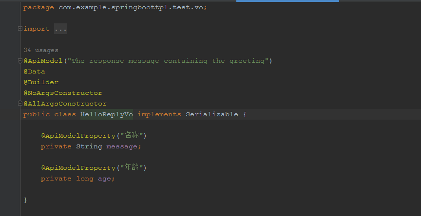
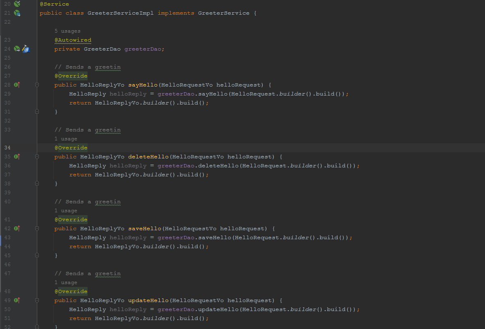
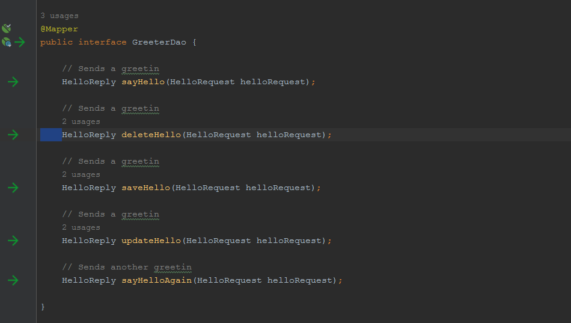
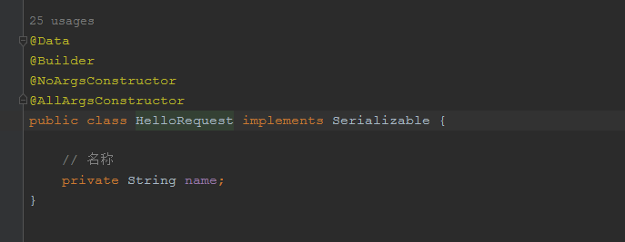

<div align="center">
  <br>
  <h1>Protoc-gen-java-curd</h1>
  <strong>快速生成接口代码，节省时间</strong>
</div>


Protoc-gen-java-curd 是一款java 模板代码生成工具，基于protobuf 插件开发的

# 1.二种安装方式

## 1.1源码安装

下载代码 git clone https://github.com/feihua/protoc-gen-java-curd.git

cd protoc-gen-java-curd目录

go install 编译安装

## 1.2 直接下二进制文件

https://github.com/feihua/protoc-gen-java-curd/releases/download/v0.1.0/protoc-gen-java-curd.rar

# 2.使用

## 2.1定义protobuf文件hello.proto

```protobuf
syntax = "proto3";

package com.example.springboottpl.test;
option go_package = "./protoc_struct";

// The greeting service definition.
service Greeter {
  // Sends a greeting
  rpc SayHello (HelloRequest) returns (HelloReply) {}
  // Sends a greeting
  rpc DeleteHello (HelloRequest) returns (HelloReply) {}
  // Sends a greeting
  rpc SaveHello (HelloRequest) returns (HelloReply) {}
  // Sends a greeting
  rpc UpdateHello (HelloRequest) returns (HelloReply) {}
  // Sends another greeting
  rpc SayHelloAgain (HelloRequest) returns (HelloReply) {}
}

// The greeting service definition test.
service GreeterTest {
  // Sends a greeting
  rpc SayHello (HelloRequest) returns (HelloReply) {}
  // Sends another greeting
  rpc SayHelloAgain (HelloRequest) returns (HelloReply) {}
}

// The request message containing the user's name.
message HelloRequest {
  string name = 1;// 名称
}

// The response message containing the greetings
message HelloReply {
  string message = 1;// 名称
  int64 age = 2;// 年龄
}
```

## 2.2使用命令如下：

```powershell
protoc --java-curd_out=./ ./hello.proto
```

## 2.3生成的代码目录如下：


### 2.3.1 controller层代码


### 2.3.2 vo层代码



### 2.3.3 service层代码


### 2.3.4 service impl层代码



### 2.3.5 dao层代码



### 2.3.6 entity层代码



### 2.3.7 mapper层代码


