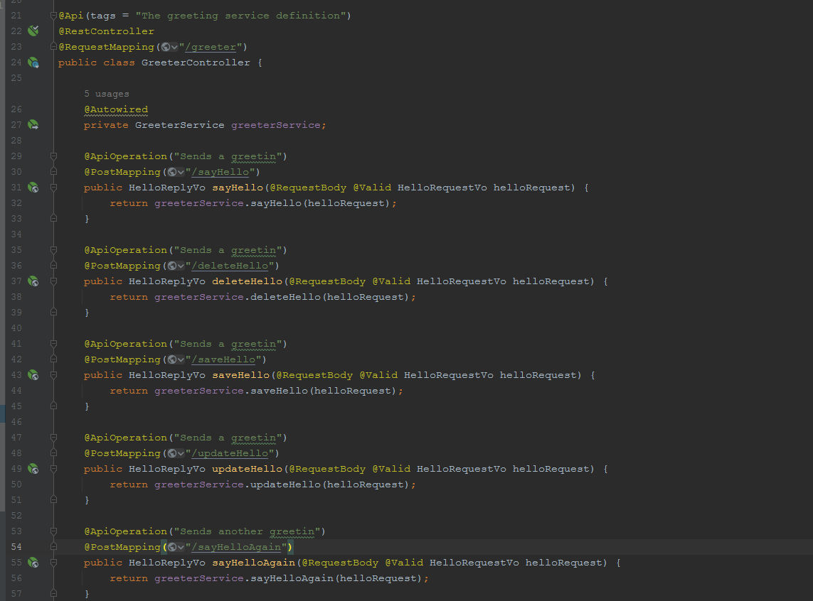
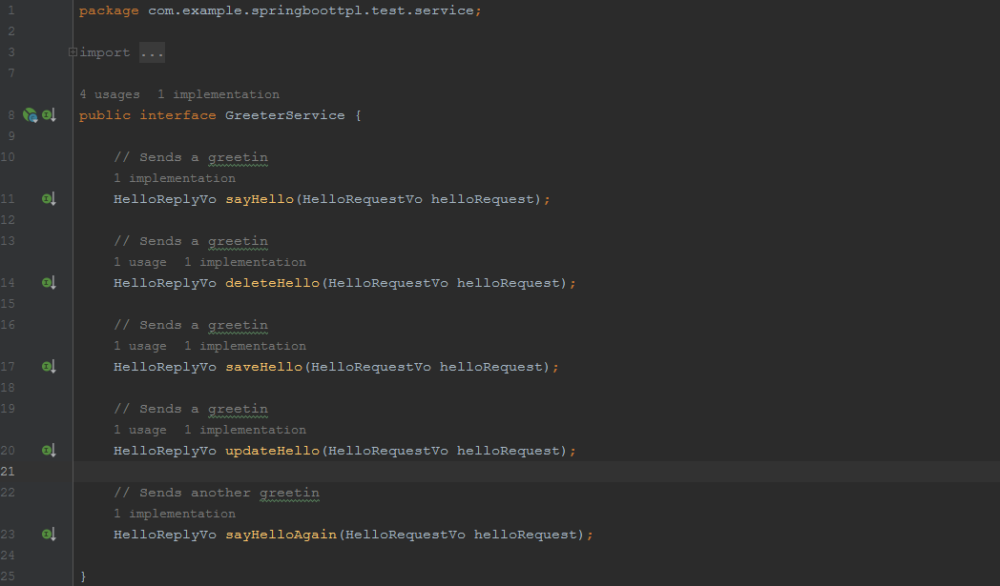

<div align="center">
  <br>
  <h1>Protoc-gen-java-curd</h1>
  <strong>快速生成接口代码，节省时间</strong>
</div>


Protoc-gen-java-curd 是一款java 模板代码生成工具，基于protobuf 插件开发的

# 1.安装


```shell
go install github.com/feihua/protoc-gen-java-curd@latest
```

# 2.使用

## 2.1定义protobuf文件hello.proto

```protobuf
syntax = "proto3";

package com.example.springboottpl.test;
option go_package = "./protoc_struct";

// The greeting service definition.
service Greeter {
  // Sends a greeting
  rpc SayHello (HelloReqVo) returns (HelloRespVo) {}
  // Sends a greeting
  rpc DeleteHello (HelloReqVo) returns (HelloRespVo) {}
  // Sends a greeting
  rpc SaveHello (HelloReqVo) returns (HelloRespVo) {}
  // Sends a greeting
  rpc UpdateHello (HelloReqVo) returns (HelloRespVo) {}
  // Sends another greeting
  rpc SayHelloAgain (HelloReqVo) returns (HelloRespVo) {}
}

// The greeting service definition test.
service GreeterTest {
  // Sends a greeting
  rpc SayHello (HelloReqVo) returns (HelloRespVo) {}
  // Sends another greeting
  rpc SayHelloAgain (HelloReqVo) returns (HelloRespVo) {}
}

// The request message containing the user's name.
message HelloReqVo {
  string name = 1;// 名称
}

// The response message containing the greetings
message HelloRespVo {
  string message = 1;// 名称
  int64 age = 2;// 年龄
  TestReply data = 3;// 返回的数据
}

//内部数据
message TestReply {
  string message = 1;// 名称
  int64 age = 2;// 年龄
}
```

## 2.2使用命令如下：

```powershell
protoc --java-curd_out=./ ./hello.proto
```

## 2.3生成的代码目录如下：


### 2.3.1 controller层代码



### 2.3.2 vo层代码


### 2.3.3 service层代码



### 2.3.4 service impl层代码


### 2.3.5 dao层代码


### 2.3.6 entity层代码


### 2.3.7 mapper层代码


